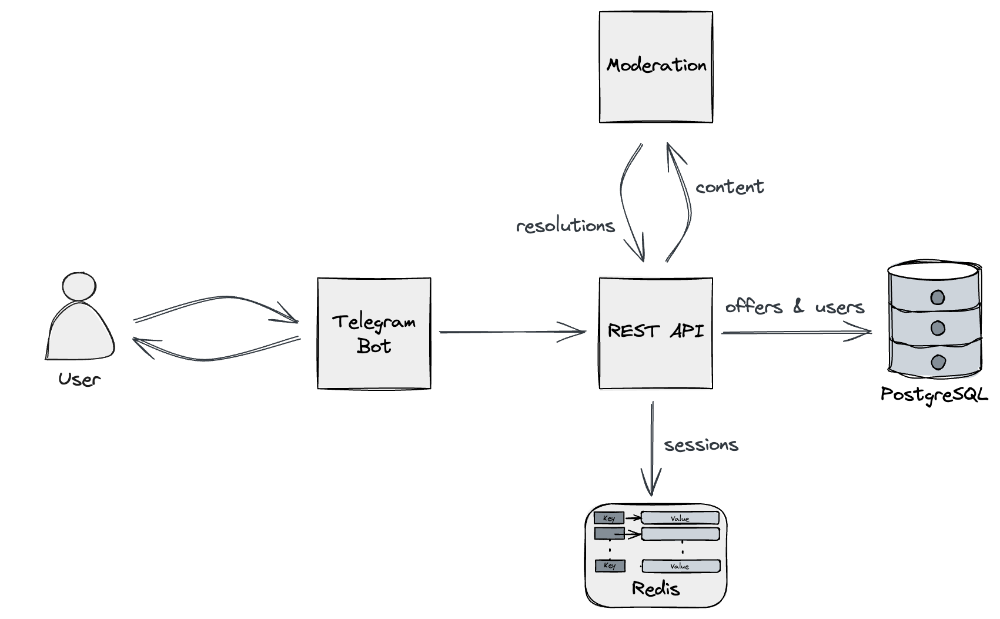
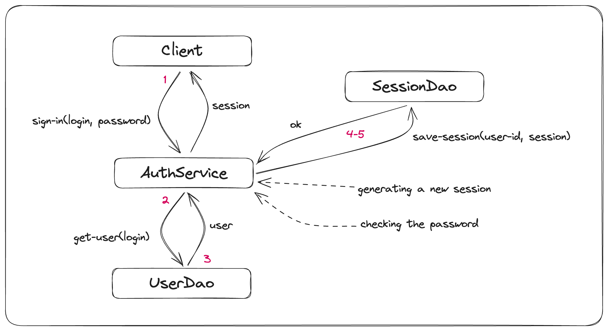
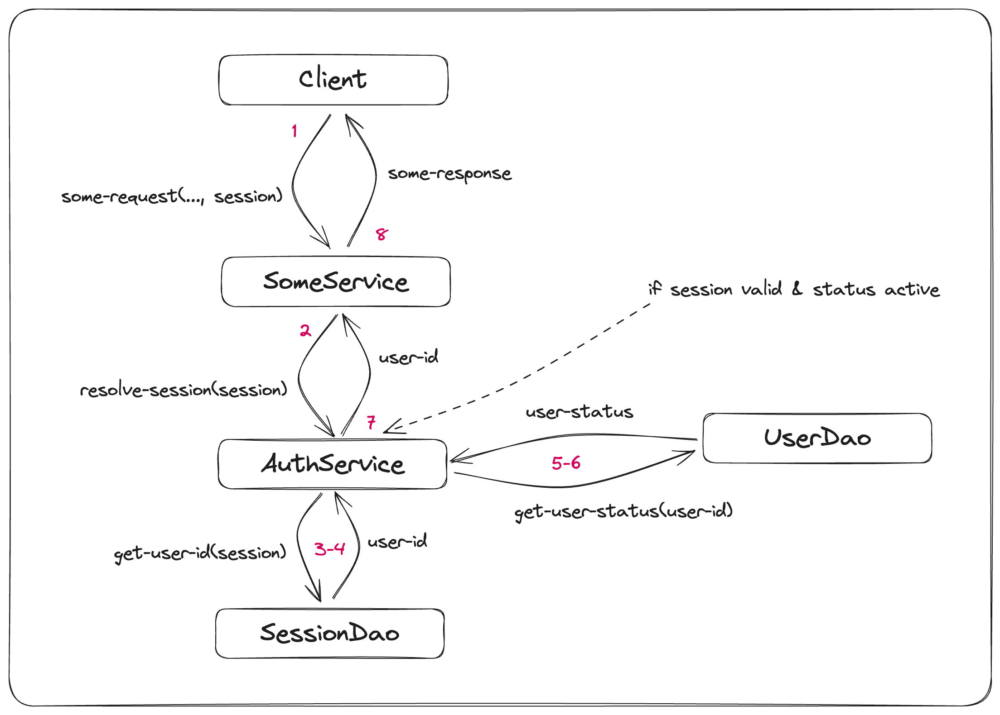
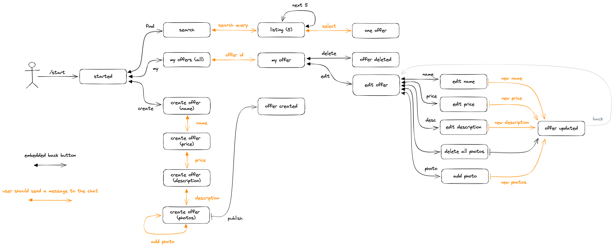

# OffersService

## Overview

The classified platform such as Craigslist or Avito that provides the opportunity for peer-to-peer exchanges of goods and services.



## How to launch

Run one of the sbt commands below to start the selected component locally with connection to other services in the Cloud.  

```bash
sbt "project service" run
sbt "project bot" run
sbt "project moderation" run
sbt "project parsing" run
```

For example, `sbt "project service" run` will launch the REST API locally, but it will send requests to PostgreSQL and Redis in the Cloud 

### Using Docker

To run the service completely locally, first of all, you need to launch PostgreSQL and Redis:

```bash
docker compose start
```

Then, start the REST-api with "local" parameter:

```bash
sbt "project service" run local
```

Then start other components with the same parameter:

```bash
sbt "project bot" run local
sbt "project moderation" run local
sbt "project parsing" run local
```

## Internals

### Database

#### Actual schema

```postgresql
create table offers
(
    id          uuid primary key,
    name        text    not null,
    price       integer not null,
    description text    not null,
    status      text    not null,
    source      text default null
);

create table users
(
    id            uuid primary key,
    name          text not null,
    login         text not null unique,
    status        text not null,
    password_hash text not null,
    password_salt text not null
);

create table user_offers
(
    offer_id uuid primary key references offers (id),
    user_id  uuid not null references users (id)
);

create table photos
(
    id   uuid primary key,
    url  text  default null,
    blob bytea default null
);

create table offer_photos
(
    photo_id uuid primary key references photos (id),
    offer_id uuid not null references offers (id)
);
```

#### Indices

Indices for searching by offers:

```postgresql
create index offers_name_idx on offers
    using gin (to_tsvector('russian', name));

create index offers_name_description_idx on offers
    using gin (to_tsvector('russian', name || ' ' || description));
```

### REST API

#### Authorization

Each user has login (telegram @login) and password, and, in order to use the service, he should get a session and then
attach it to each request

Creating a session:



Use session in some request:



### Telegram-bot

State machine diagram (without authorization to simplify):



And authorization separately:


### Parsing

Parsing gets offers from youla.ru to fill in the contents of my service 


### Moderation

Moderation Worker requests all offers with the `OnModeration` status from the REST API (in batches, with some delay) and then updating offer statuses to Active or Banned if any violations are detected


