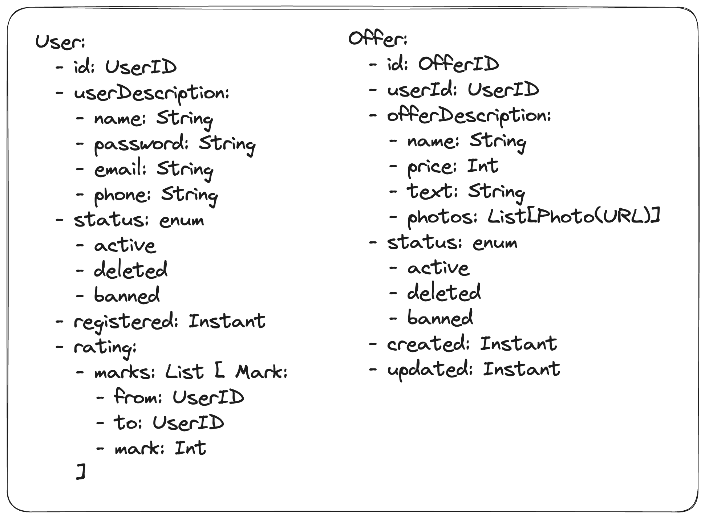
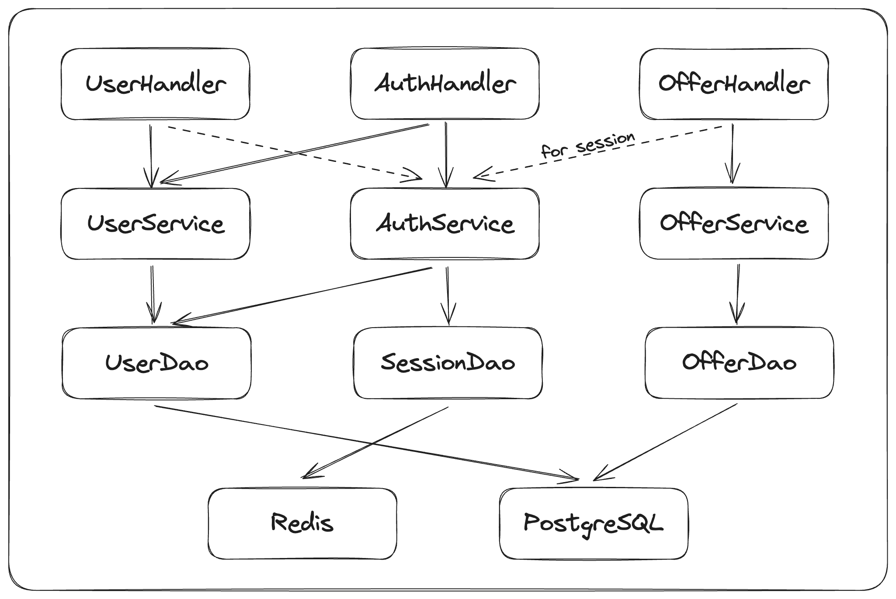
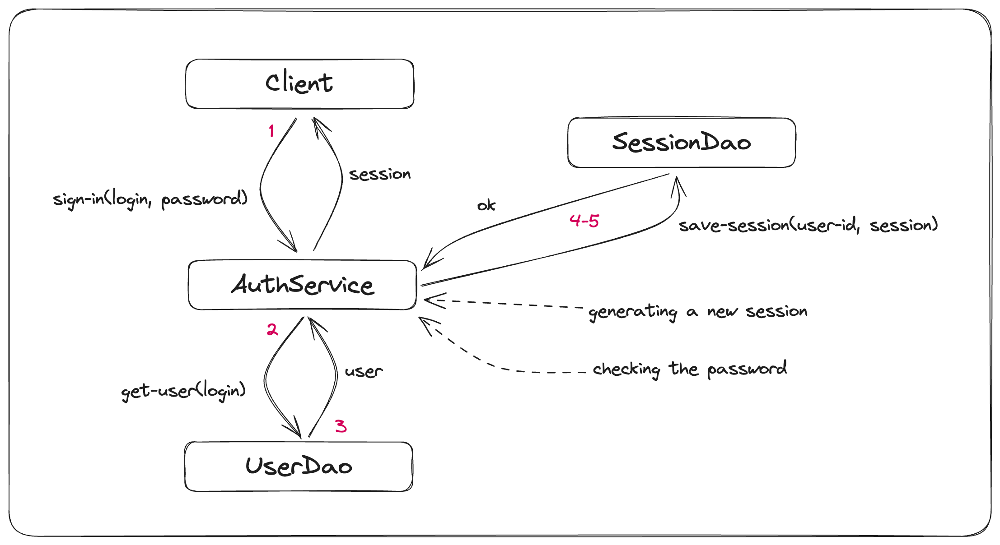
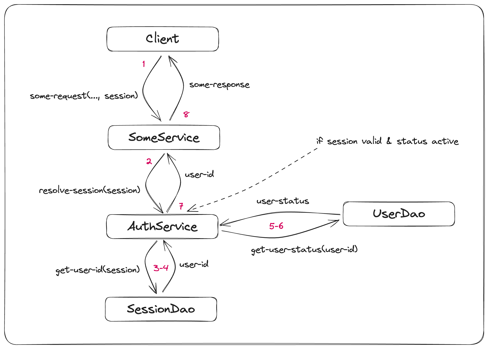
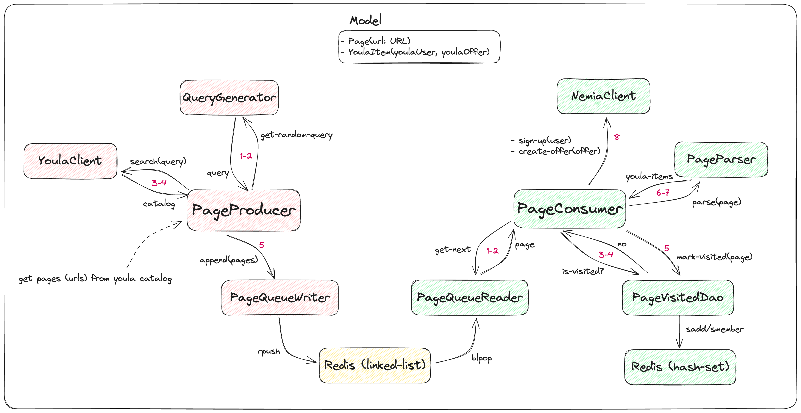

# OffersService

Проект выполнен в рамках курса по Scala на факультете МКН в СПбГУ

## Требования

Сервис объявлений по типу Авито, где пользователи смогут размещать/редактировать/удалять объявления, ставить продавцам оценки

Авторизация на платформе происходит с помощью сессии (токена), неавторизованный пользователь может только просматривать чужие объявления

Наполнение сервиса контентом (товарами) будет осуществляться через парсинг объявлений с Юлы (так как на авито слишком активно борются с парсерами :)

Технические моменты:
- два приложения: REST API и отдельно парсер
- хранение данных (пользователи, объявления) в PostgreSQL
- хранение сессий в Redis
- интерграционные тесты (с базой в докере) и CI/CD
- ретраи для http-клиентов

## Запуск

Перед стартом rest-api (`nemia`) и парсера (`parseidon`) нужно поднять контейнеры в докере

### PostgreSQL

```bash
docker run --rm --name offersql \
  -e POSTGRES_USER=postgres \
  -e POSTGRES_PASSWORD=postgres \
  -e PGDATA=/var/lib/postgresql/data/pgdata \
  -v /tmp:/var/lib/postgresql/data \
  -p 5432:5432 -it postgres:14.1-alpine
```

### Redis

Для простоты запускаю один инстанс редиса для обоих приложений (`nemia` и `parseidon`), но при желании можно запустить и два (и прописать разные хосты в конфигах)

Без мониторинга:

```bash
docker run -d --rm --name offers-redis \
  -p 6379:6379 \
  redis/redis-stack-server:latest
```

С мониторингом на http://localhost:8001/redis-stack/browser:

```bash
docker run -d --rm --name offers-redis \
  -p 6379:6379 \
  -p 8001:8001 \
  redis/redis-stack:latest
```

### Nemia

Точка входа: [nemia/.../Main.scala](nemia/src/main/scala/com/github/mmvpm/nemia/Main.scala)

После запуска будет доступен Swagger UI на http://localhost:8080/docs

### Parseidon

Точка входа: [parseidon/.../Main.scala](parseidon/src/main/scala/com/github/mmvpm/parseidon/Main.scala)

За работой парсера можно следить из [UI редиса](http://localhost:8001/redis-stack/browser) или подключившись к postgresql

## Архитектура

### Nemia

Модель хранения пользователей и объявлений (схематично):



Сама архитектура стандартна для сервиса с rest-api:



Авторизация пользователя происходит с помощью сессий (токенов), которые хранятся в Redis ограниченное количество времени (настраивается в конфиге)

Создание сессии по логину и паролю:



Использование сессии для получения UserID пользователя, от имени которого идёт запрос с клиента:



### Parseidon

Парсер состоит из двух независимых фоновых процессов (consumer и producer), которые общаются через очередь в редисе 

`PageProducer` на каждом шаге:
- случайно выбирает [один запрос из заранее заготовленной базы](parseidon/src/main/resources/queries.txt)
- посылает его в graphql Юлы, имитируя запрос реального пользователя в поисковую строку
- получает каталог товаров на сайте
- извлекает из него ссылки на объявления (`Page`)
- добавляет результаты в очередь редиса

`PageConsumer`: 
- читает из очереди ссылку на объявление
- делает запрос к Юле за самим объявлением
- парсит полученную html-страничку, доставая оттуда данные товара и продавца
- делает запрос к Nemia на создание нового пользователя (или получение сессии уже имеющегося)
- также через Nemia создает объявление под этим пользователем 


