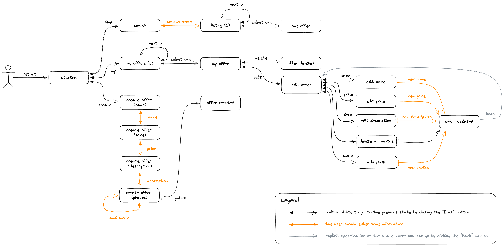

# OffersService

## How to launch

First of all, you need to launch PostgreSQL and Redis:

```bash
docker compose start
```

Then, start the REST-api:

```bash
sbt "project service" run 
```

And finally, run the telegram bot:

```bash
sbt "project bot" run 
```

## Internals

### Actual database schema

```postgresql
create table offers
(
    id          uuid primary key,
    name        text    not null,
    price       integer not null,
    description text    not null,
    status      text    not null
);

create table users
(
    id            uuid primary key,
    name          text not null,
    login         text not null unique,
    status        text not null,
    password_hash text not null,
    password_salt text not null
);

create table user_offers
(
    offer_id uuid primary key,
    user_id  uuid not null references users(id)
);
```

### Authorization

Each user has login (telegram @login) and password, and, in order to use the service, he should get a session and then attach it to each request

Creating a session:


Use session in some request:


### Telegram-bot

State machine diagram:


